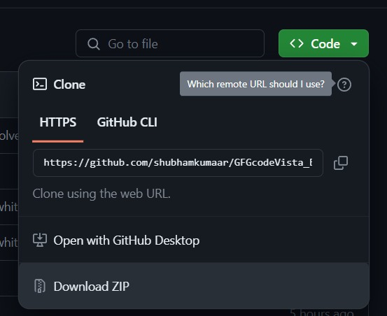

#  GeekHelper 

GeekHelper is a chrome-based extension designed to provide help for all the geeks who are continuously solving coding problems in Geeks for Geeks. It offers a code review on your submission and, a writing board where you can do your rough work while solving problems.

## Features
***Code Review***

- Provide feedback on your code.
- Checks the code quality for the problems. 
- Efficiency of the code.
- Improvement that you can make.
- Adhering to best practices.

***Writing Board***
- Every coder needs a notebook while solving the problem.
- Here, you can do rough work.
- If you have done anything important then you can save it.

## Getting Started
### Prerequisites
- Google Chrome installed on your machine.
### Installation
- Click on `Code`
- Click on `Download ZIP`

- Unzipped the download file.
- [Register to get API key of Together.ai](https://api.together.xyz/settings/api-keys)
- Open the Unzipped folder search for scripts folder open `background.js` and paste your API key
- Open `Google Chorme`
- Click on `control Google Chrome -> Extensions`
- Click on `Manage Extension`
- On top right side corner start `Developer mode`
- Then click `Load unpacked` button search for your file.

**Now Extension is Installed Successfully**

## Usage
- On submitting the problem you can see a button the stats of the problem `Get Code Review `
- On clicking this button you get the code review.
- On clicking the extension button or `Ctrl + q` you can see a popup Writing Board window.

## Contribution

- One of the ideas that can be accepted is: a user snippet which shows suggestions while typing their code(like vs code) 
- And any other suggestion for new features, improvement, or bug fixes. please submit a pull request

## Acknowledgement
- Special thanks to `Geeks for geeks` to hosting the Hackathon that led us to make this extension.
- Special thanks to `Together.ai`  And `Google Chrome`